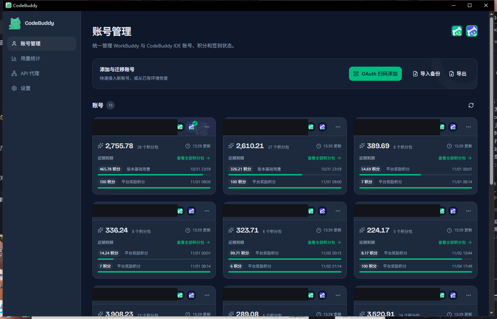

# CodeBuddy

WorkBuddy 与 CodeBuddy IDE 多账号切换桌面 App（Tauri，仅支持 Windows），国内版 / 国际版账号统一管理，提供积分到期监控、Token 用量统计与本地 API 代理中转。

本项目整合了两个开源项目的成果：[changexbc/workbuddy-switch](https://github.com/changexbc/workbuddy-switch)（账号切换、积分监控与统计、Agent 状态悬浮窗）与 [hailinzhao/antigravity-tools](https://github.com/hailinzhao/antigravity-tools)（批量签到、API Key 代理），并在此基础上合并演进为统一的桌面应用。

  

多账号共享登录态，一键切换 WorkBuddy / CodeBuddy IDE 登录账号。**会话复制**：切换账号时可把当前账号的会话以新 id 复制给目标账号，源账号数据不受影响，云端归属目标账号。

## 快速开始

前往 [GitHub Releases](https://github.com/boringstudent/codebuddy-switch/releases/latest) 下载安装包：

| 安装包 | 安装方式 |
| --- | --- |
| `CodeBuddy_<版本>_x64-setup.exe` | NSIS 安装程序，运行后按提示完成安装（推荐） |
| `CodeBuddy_<版本>_x64_en-US.msi` | MSI 安装包，适合批量部署 |
| `CodeBuddy_<版本>_x64-portable.zip` | 绿色便携版，解压后直接运行 `CodeBuddy.exe`，无需安装 |

仅提供 Windows x64 版本；运行依赖系统 WebView2（Windows 10/11 一般已内置，安装程序会自动处理）。

## 功能

| 模块 | 说明 |
| --- | --- |
| 账号管理 | OAuth 扫码登录、导入导出账号备份、删除账号、账号备注 |
| 账号切换 | 一键切换 WorkBuddy / CodeBuddy IDE（国内版 / 国际版）登录账号，切换过程实时显示进度 |
| 会话复制 | 切换账号时可勾选把当前账号的会话复制给目标账号（加法，源账号数据不受影响） |
| 积分到期查询 | 自动查询每个账号的积分剩余量与到期时间；7 天内到期高亮，并按紧迫程度排序、标注「建议优先使用」 |
| 自动签到 | 按签到时间段自动签到；账号页「刷新并签到」同样遵守时间段，未到时间段的账号逐个提示 |
| 派猫猫旅行 | 自动派发猫猫旅行并到点领取奖励 |
| 限额监听 | 通过 hook 实时捕获 429 限额事件，账号卡片秒级更新冷却状态 |
| 用量统计 | 积分统计与 Token 统计合并展示：官方请求用量总览、近 30 天趋势、模型分类、账号消耗与请求明细；Token 总览与趋势、构成占比、活跃热力图、项目/模型 Top 10 与会话排行 |
| API 代理 | 本地 OpenAI 兼容中转服务：账号库一键导入为上游 Key 池，子 API Key 分发与鉴权，专一/临期/轮询/会话亲和四种调用模式，429 冷却与风控自动切换，请求日志自动滚动与 Token/积分统计，积分刷新与状态检测后台逐个处理、表格渐进更新 |

设置 →「支持工具」可分别开关 WorkBuddy 与 CodeBuddy IDE 入口；关闭后该端入口与状态轮询一并隐藏，不影响账号库与其它端。

## 使用

1. **添加与导出账号**：账号页 →「OAuth 扫码添加」「导入备份」；「导出」可将勾选账号备份为 JSON
2. **切换账号与账号信息**：账号卡片 →「切换」，可勾选复制当前会话；「账号信息」可给账号添加备注，并选择卡片上显示账号名 / 手机号 / 备注
3. **查看积分与统计**：账号页自动查询各账号积分到期情况，点「刷新积分」手动更新（并在签到时间段内顺带签到）；侧栏进入「用量统计」查看积分与 Token 用量明细
4. **API 代理**：侧栏进入「API 代理」启动本地中转服务；「从账号导入」把账号库账号加入上游 Key 池，按需创建子 API Key 分发；接口地址 `http://127.0.0.1:<端口>/v1` 兼容 OpenAI 客户端
5. **开关各端入口**：设置 →「支持工具」可分别隐藏 / 恢复 WorkBuddy 与 CodeBuddy IDE 入口
6. **自动签到与旅行**：设置页配置签到时间段与自动签到开关；派猫猫旅行可开关自动派发

## 界面预览

### 账号管理

账号卡片集中展示登录状态、积分余额和到期资源，临期积分直接标注在对应卡片内，并按紧迫程度优先排列（截图中账号信息已打码）。

## 致谢

本项目整合自以下开源项目，感谢原作者的工作：

- [changexbc/workbuddy-switch](https://github.com/changexbc/workbuddy-switch)：WorkBuddy / CodeBuddy 账号切换、积分到期监控、积分统计与 Token 统计、Agent 状态悬浮窗（MIT）
- [hailinzhao/antigravity-tools](https://github.com/hailinzhao/antigravity-tools)：WorkBuddy / CodeBuddy 批量签到与 API Key 代理

## 许可

[MIT](./LICENSE)
